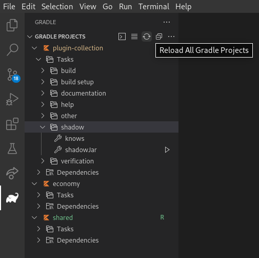

<div id="top"></div>
<!--
*** Thanks for checking out the Best-README-Template. If you have a suggestion
*** that would make this better, please fork the repo and create a pull request
*** or simply open an issue with the tag "enhancement".
*** Don't forget to give the project a star!
*** Thanks again! Now go create something AMAZING! :D
-->


<!-- PROJECT LOGO -->
<br />
<div align="center">
  <a href="https://github.com/Pickaria/plugin-collection">
    
  </a>

<h3 align="center">Pickaria</h3>

  <p align="center">
    Multi function plugin for the Pickaria Minecraft server.
    <br />
    <br />
    <a href="https://www.pickaria.fr">Try it</a>
    ·
    <a href="https://github.com/Pickaria/plugin-collection/issues">Report Bug</a>
    ·
    <a href="https://github.com/Pickaria/plugin-collection/issues">Request Feature</a>
  </p>
</div>


<!-- TABLE OF CONTENTS -->
<details>
  <summary>Table of Contents</summary>
  <ol>
    <li>
      <a href="#about-the-project">About The Project</a>
      <ul>
        <li><a href="#built-with">Built With</a></li>
      </ul>
    </li>
    <li>
      <a href="#getting-started">Getting Started</a>
      <ul>
        <li><a href="#prerequisites">Prerequisites</a></li>
        <li><a href="#installation">Compiling</a></li>
      </ul>
    </li>
    <li><a href="#contributing">Contributing</a></li>
    <li><a href="#contact">Contact</a></li>
  </ol>
</details>


<!-- ABOUT THE PROJECT -->
## About The Project

This is the plugin of the [Pickaria](https://www.pickaria.fr) Minecraft server.


<!-- GETTING STARTED -->
## Getting Started

This is the instructions on setting up your project locally.
To get a local copy up and running follow these steps.

### Prerequisites

* [Gradle](https://gradle.org/)
* JDK 17
* Either [IntelliJ IDEA](https://www.jetbrains.com/idea/) or [VSCode](https://code.visualstudio.com/)

### Working on the project

<details>
<summary>Recommended setup: IntelliJ IDEA</summary>

1. Clone the repository
   ```sh
   # Using HTTPS
   git clone https://github.com/Pickaria/plugin-collection.git
   
   # Using SSH (recommended)
   git clone git@github.com:Pickaria/plugin-collection.git
   ```
   If using SSH, remember to [add an SSH key](https://github.com/settings/keys) on your GitHub profile.

2. Open the project in IntelliJ IDEA and wait for it to load everything
3. Install JDK
   1. Go to _File_ → _Project Structure_
   2. In the new window, open the _SDK_ dropdown then select _Add SDK_ → _Download JDK..._
   3. This should open the following window, select the version 17 and Temurin Vendor  
      
   4. Let the IDE index the newly downloaded JDK, this can take a while depending on your computer
   5. Alternatively, you can install JDK manually
      ```shell
      # Debian/Ubuntu
      sudo apt install openjdk-17-jdk

      # Fedora
      sudo dnf install java-17-openjdk
      ```
      For Windows, download Temurin from [Adoptium](https://adoptium.net/)
4. Once the JDK is set-up, open the _Gradle_ on the right of the IDE, and click on the _Reload All Gradle Projects_ button, this will download and index all the dependencies required by the plugins  
   
5. Now you can switch task in your IDE, select the _setup-server-[linux|windows]_ task.  
   Choose the task according to your operating system, either Linux or Windows.  
   Run the task by clicking the green arrow, this will download and setup a test server  
   
6. Once everything is done, you can run the _start-server_ task, this will run the _shadow_ task first and start a test server on your computer.  
   While the server is running, you can run the _shadow_ task to compile the plugins, the jar files are automatically placed in the test server's plugins folder.
</details>

<details>
<summary>Using Visual Studio Code</summary>

1. Clone the repository
   ```sh
   # Using HTTPS
   git clone https://github.com/Pickaria/plugin-collection.git
   
   # Using SSH (recommended)
   git clone git@github.com:Pickaria/plugin-collection.git
   ```
   If using SSH, remember to [add an SSH key](https://github.com/settings/keys) on your GitHub profile.
2. Open Visual Studio Code and install the [Java extension](https://marketplace.visualstudio.com/items?itemName=vscjava.vscode-java-pack), [Gradle](https://marketplace.visualstudio.com/items?itemName=vscjava.vscode-gradle) and a Kotlin extension
3. Manually install JDK
   ```shell
   # Debian/Ubuntu
   sudo apt install openjdk-17-jdk

   # Fedora
   sudo dnf install java-17-openjdk
   ```
   For Windows, download Temurin from [Adoptium](https://adoptium.net/)
4. Once JDK is set-up and Gradle extension is installed, open the _Gradle_ tab on the left and click the _Reload All Gradle Projects_ button, this will download and index all the dependencies required by the plugins  
   
5. Now you can run the task in your IDE, click on _Terminal_ → _Run Task..._ and select the _setup-server_ task.  
   The task will auto detect your operating system and install a test server.  
6. Once everything is done, you can run the _start-server_ task to start the test server and run the _shadow_ task to compile the plugins, the jar files are automatically placed in the test server's plugins folder.
</details>

<details>
<summary>Manual setup</summary>

1. Clone the repository
   ```sh
   # Using HTTPS
   git clone https://github.com/Pickaria/plugin-collection.git
   
   # Using SSH (recommended)
   git clone git@github.com:Pickaria/plugin-collection.git
   ```
   If using SSH, remember to [add an SSH key](https://github.com/settings/keys) on your GitHub profile.
2. Create the test server
   ```shell
   ./scripts/setup-server.sh
   ```
3. Set the `DESTINATION_DIRECTORY` environment variable to "build" or "plugins" (optional, defaults to "plugins")  
   This tells Gradle to put your plugins into the `$rootDir/build` directory or `$rootDir/server/plugins`
   If you set it to "build", you'll have to manually copy the files into the server's plugins directory
4. Compile using Gradle
   ```shell
   # Linux
   ./gradlew shadowJar

   # Windows
   gradlew.bat shadowJar
   ```
5. Start the test server
   ```shell
   cd server
   java -jar -Xmx2G paper.jar nogui
   ``` 
   You can also add a run shortcut in your favourite IDE.
</details>


<!-- CONTRIBUTING -->
## Contributing

If you have a suggestion that would make this better, please fork the repo and create a pull request.
You can also simply open an issue with the tag "enhancement".

1. Check the [issues](https://github.com/Pickaria/plugin-collection/issues) page to find something you want to work on.
2. Fork the Project or create your a new branch (`git checkout -b feature/AmazingFeature`)
3. Commit your Changes (`git commit -m 'Add some AmazingFeature'`)
4. Push to the Branch (`git push origin feature/AmazingFeature`)
5. Open a Pull Request


<!-- CONTACT -->
## Contact

[@pickaria](https://twitter.com/pickaria) - contact@pickaria.fr

Project Link: [https://github.com/Pickaria/plugin-collection](https://github.com/Pickaria/plugin-collection)