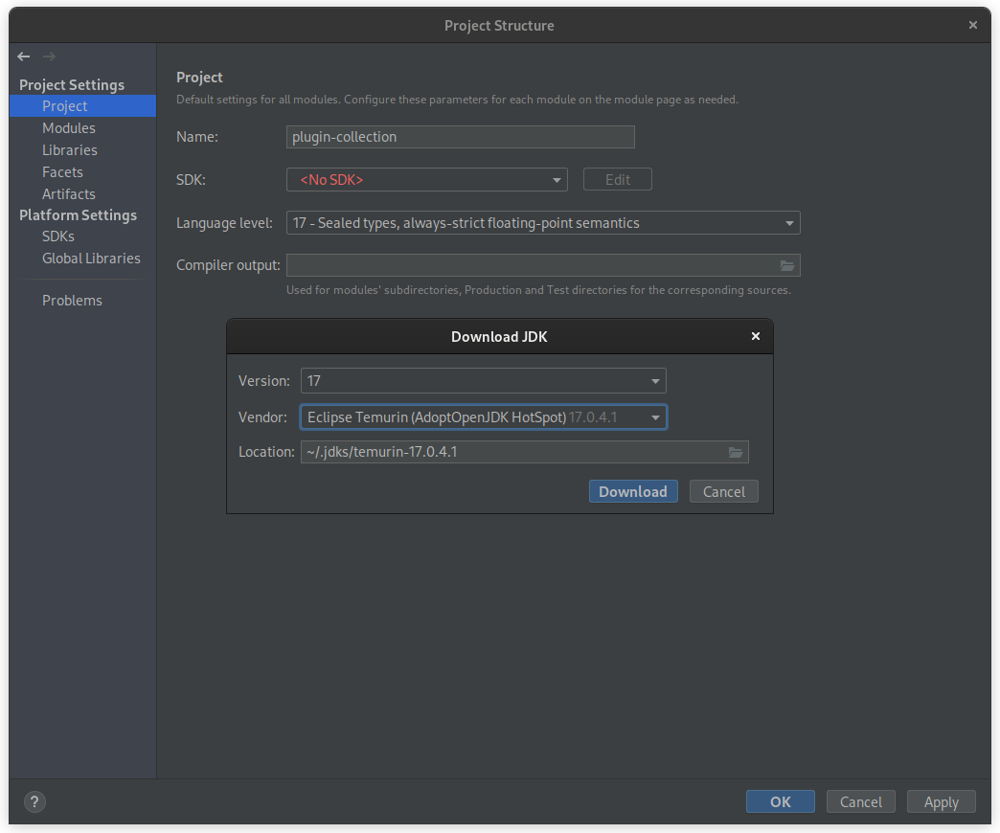
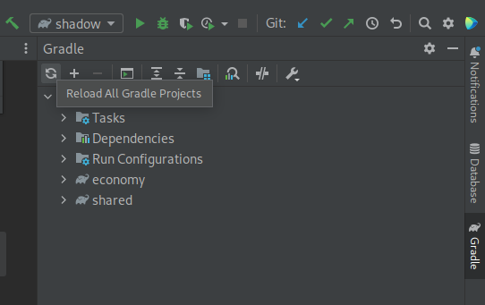

<!-- PROJECT LOGO -->
<br />
<div align="center">
  <a href="https://github.com/Pickaria/plugin-collection">
    
  </a>

<h3 align="center">Pickaria</h3>
  <p align="center">
    Multi purpose plugin for the Pickaria Minecraft server.
    <br />
    <br />
    <a href="https://www.pickaria.fr">Try it</a>
    ·
    <a href="https://github.com/Pickaria/plugin-collection/issues">Report Bug</a>
    ·
    <a href="https://github.com/Pickaria/plugin-collection/issues">Request Feature</a>
  </p>
</div>


<!-- TABLE OF CONTENTS -->
<details>
  <summary>Table of Contents</summary>
  <ol>
    <li>
      <a href="#about-the-project">About The Project</a>
    </li>
    <li>
      <a href="#getting-started">Getting Started</a>
      <ul>
        <li><a href="#prerequisites">Prerequisites</a></li>
      </ul>
    </li>
    <li><a href="#dependencies">Dependencies</a></li>
      <ul>
        <li><a href="#working-on-the-project">Working on the project</a></li>
      </ul>
    <li><a href="#contributing">Contributing</a></li>
    <li><a href="#contact">Contact</a></li>
  </ol>
</details>


<!-- ABOUT THE PROJECT -->

## About The Project

This is the plugin of the [Pickaria](https://www.pickaria.fr) Minecraft server.


<!-- GETTING STARTED -->

## Getting Started

This is the instructions on setting up your project locally.
To get a local copy up and running follow these steps.

### Prerequisites

* [Gradle](https://gradle.org/)
* JDK 17
* [IntelliJ IDEA](https://www.jetbrains.com/idea/)
* Add GitHub Credentials to Gradle configuration

## Dependencies

Following are the platform's dependencies required for this plugin to work:

- Platform: [PaperMC](https://papermc.io/)
- Economy: [Vault](https://www.spigotmc.org/resources/vault.34315/)
- Permissions: [LuckPerms](https://luckperms.net/)
- Vote notifications: [NuVotifier](https://www.spigotmc.org/resources/nuvotifier.13449/)

### Working on the project

<details>
<summary>Add GitHub Credentials</summary>

1. Create credentials
   Follow the guide here
   on [Managing your personal access tokens](https://docs.github.com/en/authentication/keeping-your-account-and-data-secure/managing-your-personal-access-tokens).
2. Add these to the file `~/.gradle/gradle.properties`
    ```properties
    gpr.user = YourGitHubUsername
    gpr.key = github_pat_***  # Replace this with the token previously generated
    ```

</details>

<details>
  <summary>Using IntelliJ IDEA</summary>

1. Clone the repository
   ```sh
   # Using HTTPS
   git clone https://github.com/Pickaria/Deepslate.git
   
   # Using SSH (recommended)
   git clone git@github.com:Pickaria/Deepslate.git
   ```
   If using SSH, remember to [add an SSH key](https://github.com/settings/keys) on your GitHub profile.

2. Open the project in IntelliJ IDEA and wait for it to load everything
3. Install JDK
    1. Go to _File_ → _Project Structure_
    2. In the new window, open the _SDK_ dropdown then select _Add SDK_ → _Download JDK..._
    3. This should open the following window, select the version 17 and Temurin Vendor  
       
    4. Let the IDE index the newly downloaded JDK, this can take a while depending on your computer
    5. Alternatively, you can install JDK manually
       ```shell
       # Debian/Ubuntu
       sudo apt install openjdk-17-jdk
 
       # RHEL/Fedora
       sudo dnf install java-17-openjdk
       ```
       For Windows, download Temurin from [Adoptium](https://adoptium.net/)
4. Once the JDK is set up, open the _Gradle_ on the right of the IDE, and click on the _Reload All Gradle Projects_
   button, this will download and index all the dependencies required by the plugins  
   

<!--
5. Run the `setupServer` Gradle task to create a test server.
6. Once everything is done, you can run the _start-server_ task, this will run the _shadow_ task first and start a test
   server on your computer.  
   While the server is running, you can run the _shadow_ task to compile the plugins, the jar files are automatically
   placed in the test server's plugins folder.
-->

</details>

<!-- CONTRIBUTING -->

## Contributing

If you have a suggestion that would make this better, please fork the repo and create a pull request.
You can also simply open an issue with the tag "enhancement".

1. Check the [issues](https://github.com/Pickaria/plugin-collection/issues) page to find something you want to work on.
2. Fork the Project or create a new branch (`git checkout -b feature/AmazingFeature`)
3. Commit your Changes (`git commit -m 'Add some AmazingFeature'`)
4. Push to the Branch (`git push origin feature/AmazingFeature`)
5. Open a Pull Request

<!-- CONTACT -->

## Contact

[@pickaria](https://twitter.com/pickaria) - contact@pickaria.fr

Project Link: [https://github.com/Pickaria/Deepslate](https://github.com/Pickaria/plugin-collection)